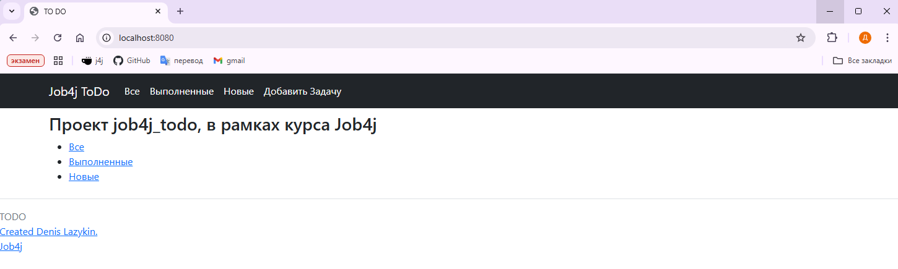
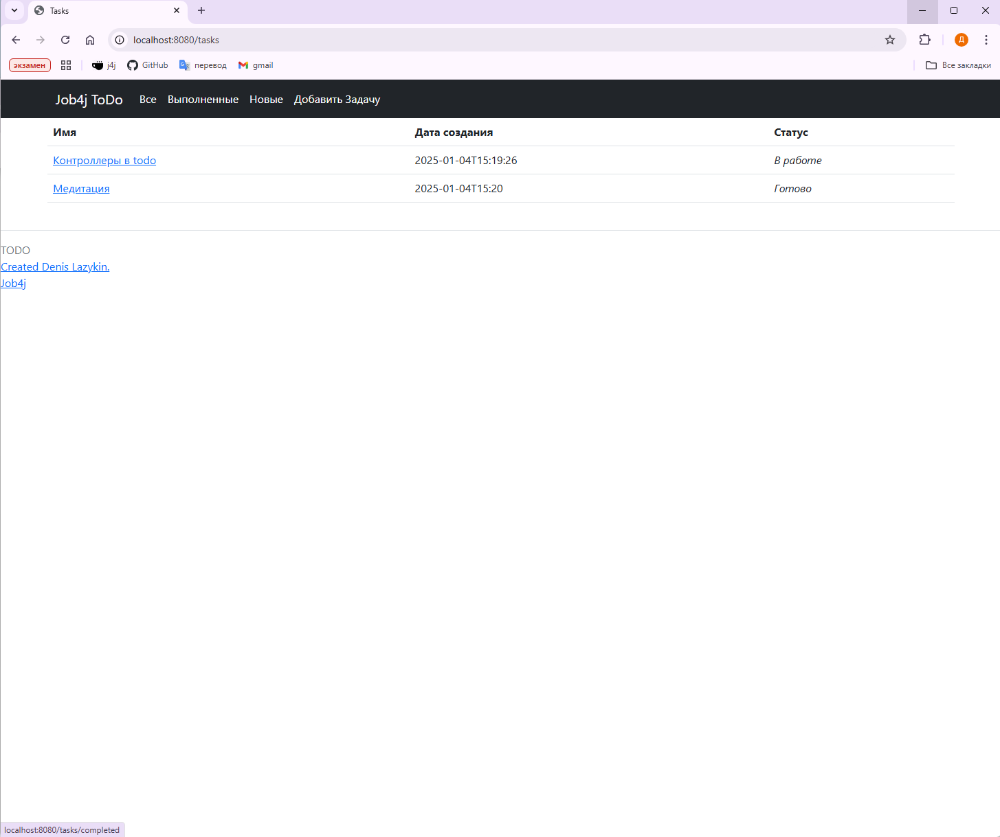
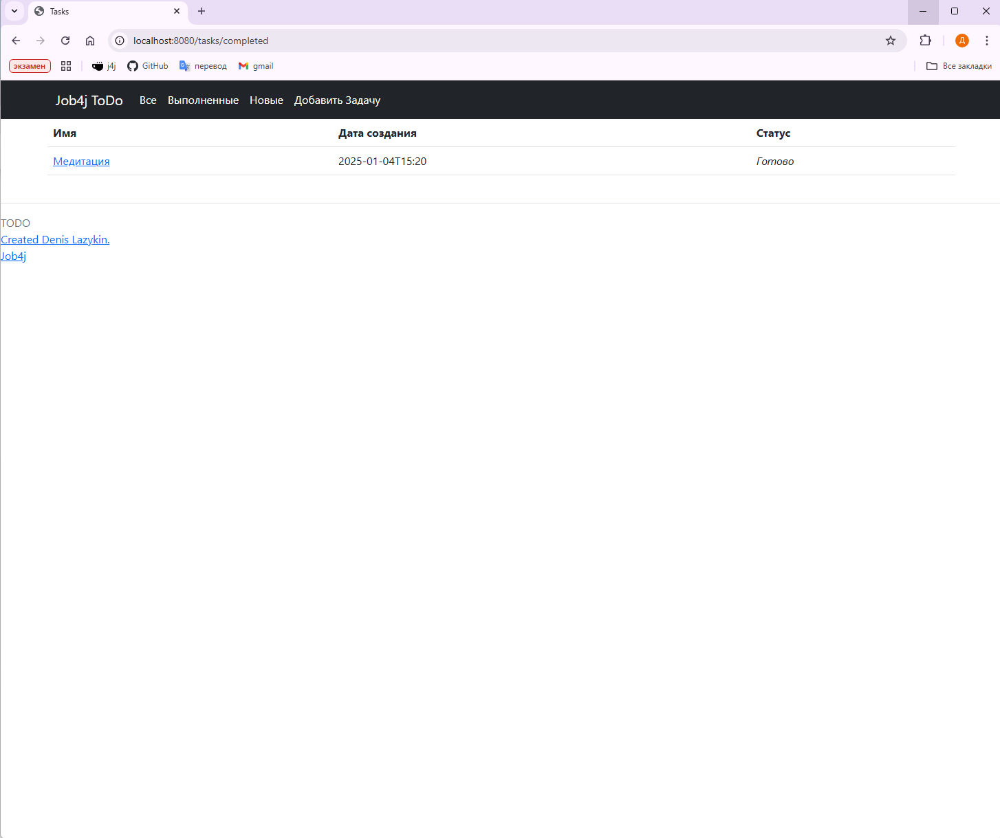
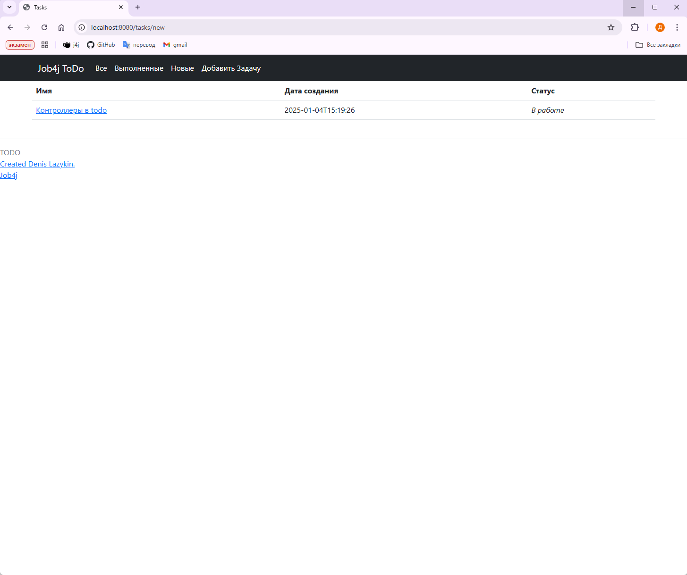
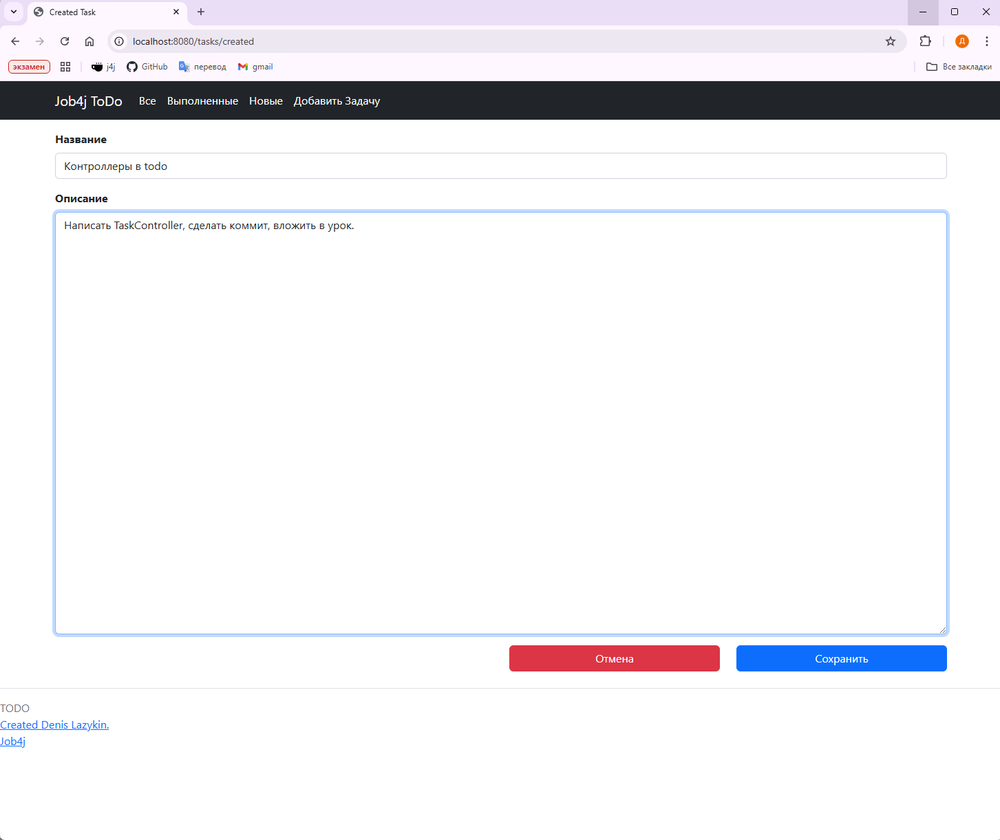
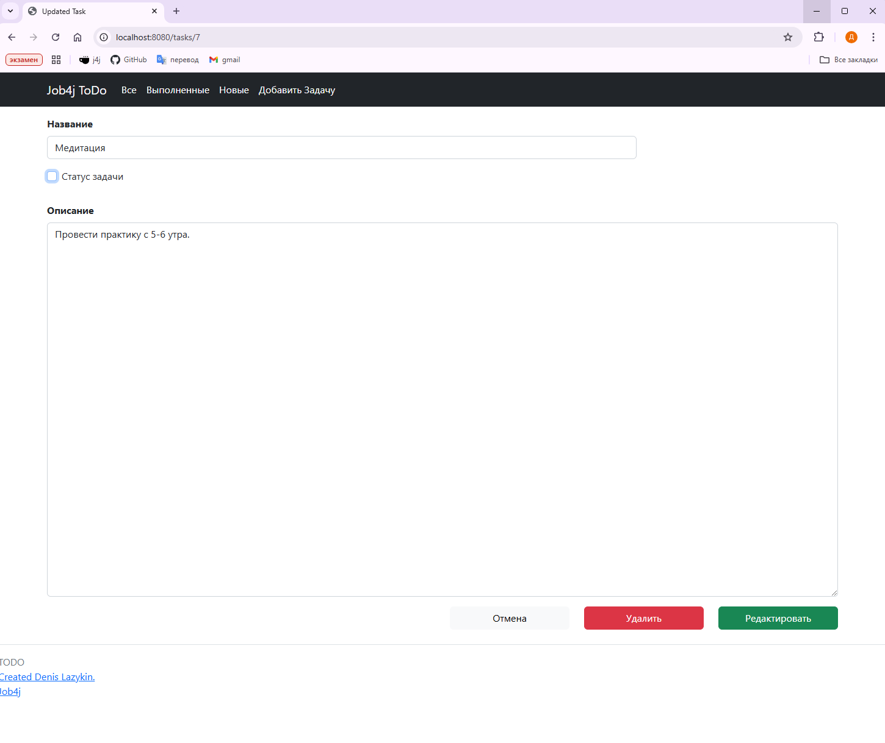

# Job4j_TODO Приложение "TODO список".

## Описание:
В данном проекте реализуется сервис со списком задач.
Сервис позволяет:
1. Вывести все задачи
2. Вывести только новые задачи
3. Вывести только выполненные задачи
4. Добавить задачу (название задачи, её описание)
5. Обновить задачу (название, описание, статус (новый или выполненный))
6. Удалить задачу

Стек технологий:
+ Java 17
+ PostgreSQL
+ Springframework.boot 2.7.6
+ Hibernate
+ Lombok
+ H2database
+ Liquibase

## Окружение:
- Java 17
- PostgreSQL 16
- Maven 3.8

## Запуск проекта
1. Создайте базу данных
``` sql
CREATE DATABASE todo
```

2. Клонируйте репозиторий
``` bash
git clone https://github.com/itlazykin/job4j_todo
cd job4j_todo
```

3. Соберите проект с помощью Maven:
``` bash
mvn clean install 
```

4. Запустите приложение:
``` bash
mvn spring-boot:run
```

После запуска, проект будет доступен по адресу: [http://localhost:8080](http://localhost:8080)

## Взаимодействие с приложением

1. Стартовая страница



2. Все задачи



3. Только выполненные



4. Только новые



5. Добавление задачи



6. Обновление задачи



#### Контакты для связи:
* Лазыкин Денис Андреевич;
* +7 926 888 23 28;
* @slimdenchi
